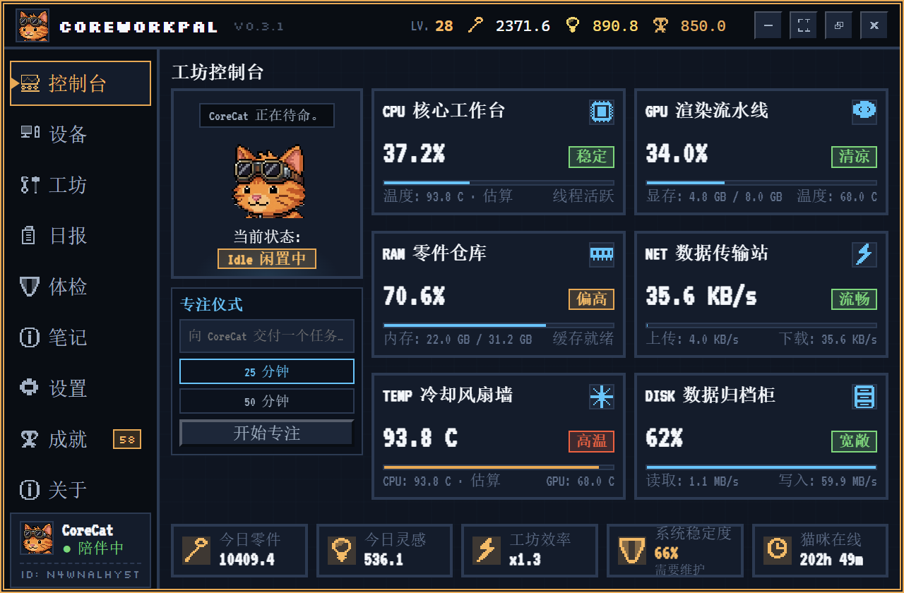
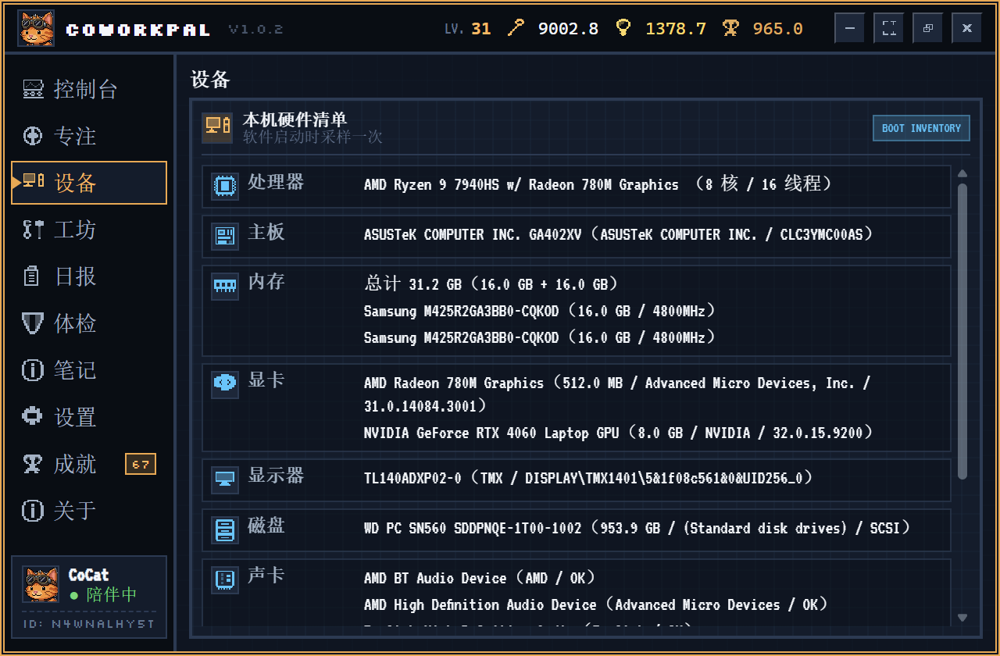
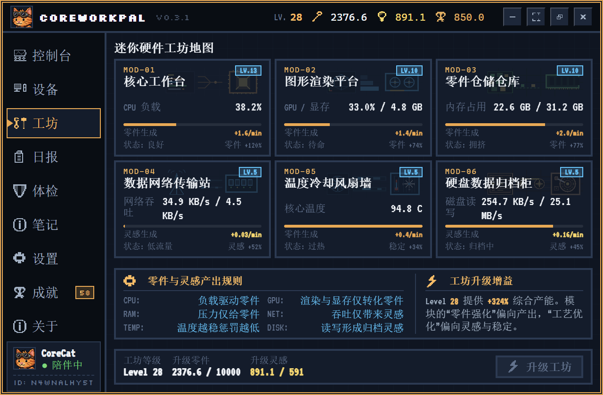
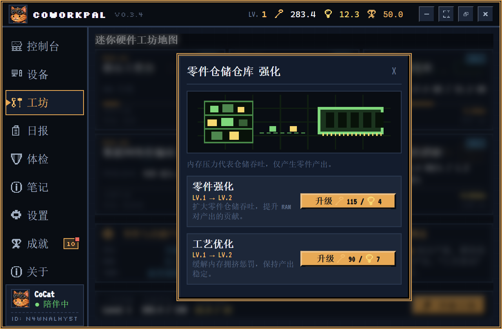
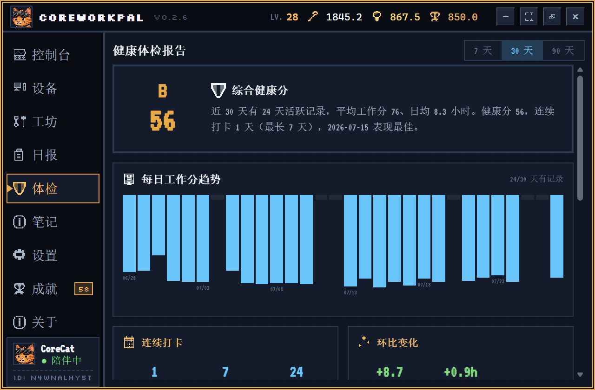
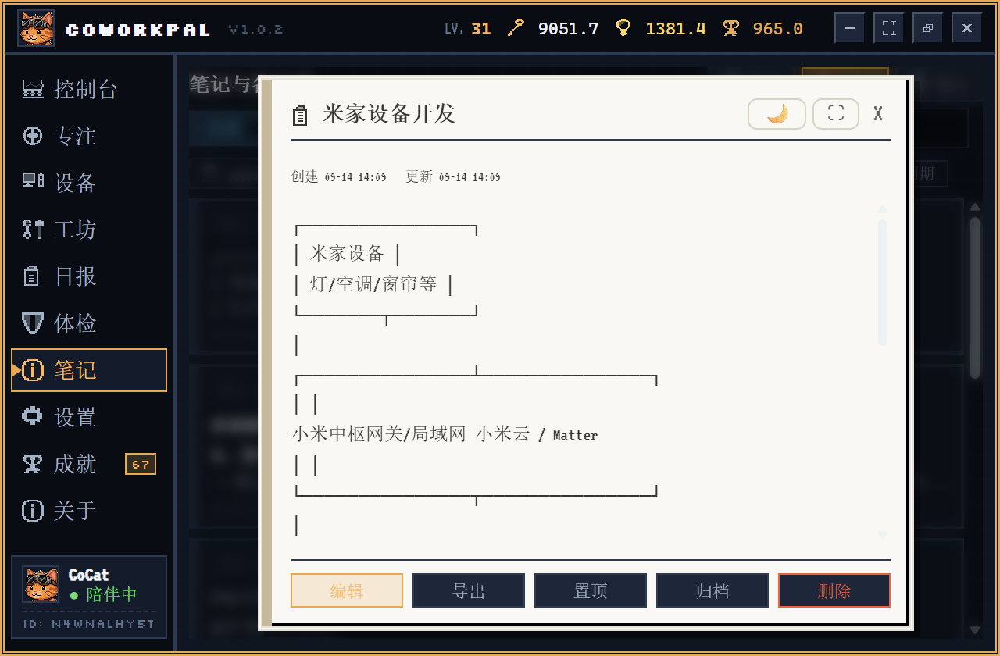
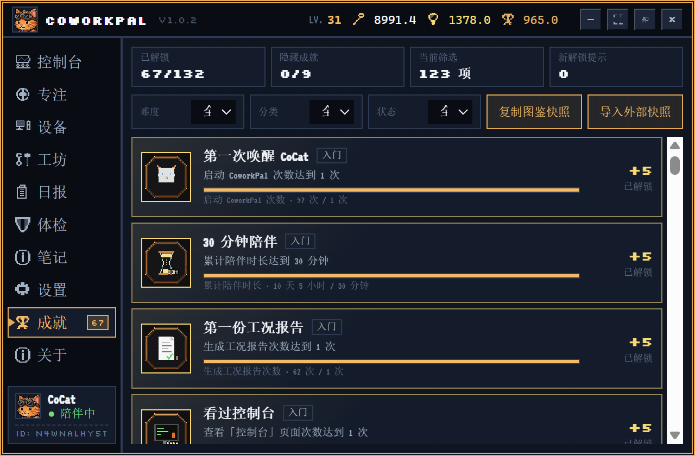
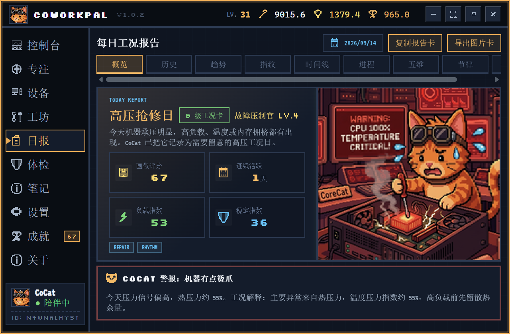
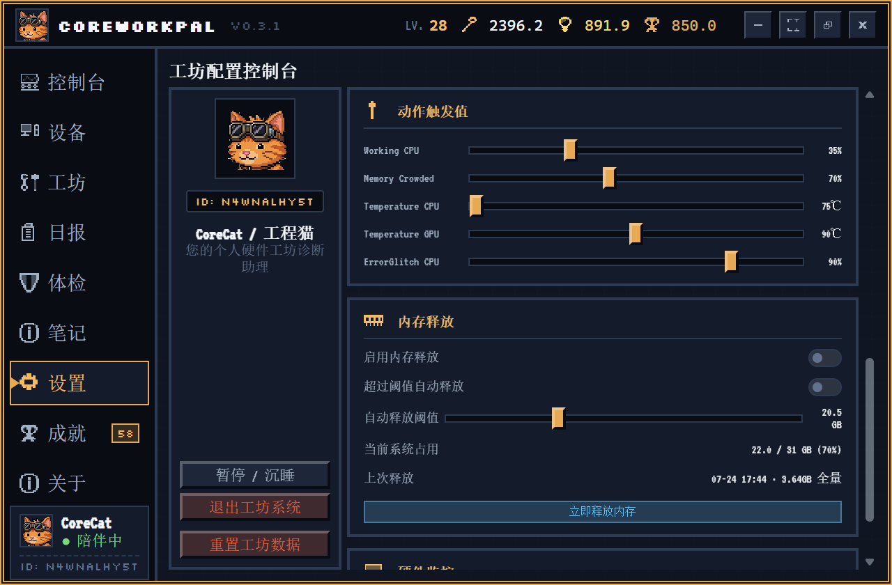
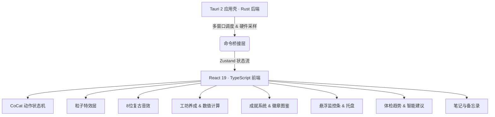

# CoworkPal ⚙️🐱

> **把你的 CPU/GPU/RAM 占用率，变成一只猫的冒险故事。**

**CoworkPal** 是一款面向开发者与重度 PC 用户的轻量级桌面伴侣，基于 **Tauri 2 + React 19 + TypeScript + Rust** 构建。它实时监控你电脑的硬件状态（CPU、GPU、内存、温度、网络、磁盘），并将这些枯燥的数字转化为一只叫 **CoCat** 的像素猫咪的动态行为、工坊养成进度、健康趋势洞察、可收藏的笔记备忘，以及可收集的成就徽章——让每一天的工作都变得更有趣、更有序。

---

## 🚀 v1.0.1

- **令牌可查看和管理**：管理员可查看、复制、重置和停用用户令牌，并查看每个用户的稳定唯一 ID
- **重装后完整恢复**：桌面端可通过用户唯一 ID 申请恢复历史令牌，管理员批准后自动拉取完整云端数据
- **自动备份更可靠**：开关与间隔立即保存；启用、启动或连接配置变化后先上传一次，再按设定间隔持续备份
- **完整自托管同步**：支持令牌申请与恢复、管理员审核、历史版本清单、HTTP / HTTPS 接入和 Docker 管理看板
- **总览式管理看板**：集中查看用户在线时间、工坊等级、日报、体检、成就、笔记以及 CPU、显卡、内存、磁盘等设备配置
- **清晰一致的任务栏监控**：采用 DirectWrite + Direct2D 预乘 Alpha 合成，加入 DPI 感知和内置固定字体
- **内置硬件温度监控**：随应用提供硬件传感器助手和 PawnIO 安装程序，并增加完整性校验、诊断日志与安全输出目录
- **更稳定的桌面运行**：补充生产日志轮换、Windows STA 初始化和窗口生命周期处理

前往 [CoworkPal v1.0.1 Release](https://github.com/FiveDayZ/CoworkPal/releases/tag/v1.0.1) 下载安装包。

---

## 🌟 它能做什么？

### 🐈 CoCat 桌面宠物 · 硬件驱动的活体表演

CoCat 是一只透明悬浮在桌面上的像素猫咪，她的行为完全由你的**实时硬件状态**驱动：

| 你的电脑状态 | CoCat 的反应 |
|:---|:---|
| CPU 高负载 | 疯狂整理文件、汗流浃背地修电脑 |
| 内存快满了 | 抱头蹲在角落、发出警告声 |
| 温度过高 | 拿扇子拼命扇风、喘粗气 |
| 系统闲置 | 懒洋洋打盹、偶尔伸懒腰 |
| 刚刚升级 | 蹦跳庆祝、满屏星光粒子特效 |
| 检测到编译任务 | 陪你一起敲键盘，给出专属反应 |

- **多层动画系统**：骨骼节点驱动的帧动画、CSS 变换、独立的粒子特效层（气泡、火花、蒸汽、星光）
- **进程感知**：识别编译器 / 浏览器 / IDE / 游戏等进程类型，CoCat 会在气泡里讲出对应的小故事
- **8 位复古音效**：升级、互动、报警触发时配有机械感的像素音效反馈
- **可互动**：点击"抚摸猫咪"或"整理零件"，CoCat 会有专属响应动作

---

### 🛠️ 硬件养成工坊 · 让负载变成资源

工坊系统将你每天使用电脑产生的硬件负载转化为可用资源：

- **CPU / GPU / 内存** 占用 → 产生 🔧 **零件**
- **网络吞吐 / 磁盘读写** 活跃度 → 产生 💡 **灵感**

用这些资源可以升级：
- **工坊主等级**（全局产出加成，上限 100 级）
- **6 大硬件工作台子模块**：CPU 核心工作台、GPU 渲染流水线、RAM 零件仓库、NET 数据传输站、TEMP 冷却风扇墙、DISK 数据归档柜

每个模块升级都有独立的效能加成曲线与非线性资源消耗设计，适合长期策略养成。

---

### 📊 系统监控 · 实时、专业、无打扰

- **悬浮监控条**：微型 / 默认 / 展开三档布局，可自由拖动并记忆位置，支持任意组合显示 CPU、内存、磁盘、网络、GPU 等指标
- **任务栏状态集成**：可嵌入系统任务栏辅助区，常驻显示核心数据；右键任务栏区域可唤起与托盘图标一致的原生快捷菜单
- **主控制台仪表盘**：六大硬件模块实时状态卡片 + 历史负载走势图表 + 诊断日志
- **内存释放**：匹配开源方案中优秀的内存回收机制，支持手动一键释放（托盘菜单 / 设置面板 / 任务栏右键）与按阈值自动释放
  - 手动释放触发 UAC 提权后执行全量清理（清空 Standby / Modified 列表、系统文件缓存工作集、所有进程工作集），拒绝提权则自动降级为轻量清理
  - 自动释放监测系统内存占用，超过设定阈值（默认 8 GB，可调）时静默执行轻量清理，60 秒冷却防抖，不打扰用户
  - 释放完成后 CoCat 播放专属动画并在气泡中反馈释放结果
- **内置高精度温度源**：可选启用随 CoworkPal 打包的硬件传感器助手，按 CPU / GPU 硬件类型读取 Core Average、CPU Package 与 GPU Core 等真实传感器；无需另装监控软件，首次开启需确认 Windows 管理员权限，无可靠 CPU 传感器时显示 N/A

---

### 📋 工况日报 · 自动生成每日记录

- 每日自动汇总当天的硬件负载曲线、资源产出、异常事件
- 可生成带评级（C / B / A / S / SS）的工况卡片，评级由工作分、连续打卡、负载强度、稳定度综合决定
- 工况卡片稀有度会触发对应的成就解锁
- 支持「复制报告卡」与「导出图片卡」（PNG）两种分享方式

---

### 🩺 体检页面（health_check_page） · 你的工作健康画像

把分散在日报里的数据拉长到周/月尺度，回答"我最近的工作状态怎么样"。所有聚合都走轻量的单日打分路径（O(1)），即使 90 天也能毫秒级生成。

- **三档时间窗口**：7 天 / 30 天 / 90 天自由切换，适配短期复盘与长期趋势
- **每日工作分趋势**：柱状图直观呈现每天的得分走势，一眼看出高产日与低谷日
- **综合健康分**：独立的 0–100 评分算法，融合「持续活跃度 / 系统稳定度 / 坚持一致性」三个维度，给出 S / A / B / C 评级——它不奖励蛮干，而是奖励可持续的节奏
- **五维均值**：运行时长、负载强度、任务复杂、系统稳定、连续投入的周期平均，定位短板
- **工作日画像**：周一到周日的平均分对比，告诉你哪天最高产
- **连续打卡 & 环比**：当前连续天数 / 最长连续 / 活跃天数，以及本周期相对上一周期的变化（带正向 / 负向着色）
- **周期亮点**：最高分日、最长工作日、最热日一目了然

> 体检页是纯本地的自我观察工具，数据全部来自已有的工况日志，不引入任何额外采集。

---

### 📝 笔记页面（note_page） · 笔记与备忘录一体化

一个轻量的本地记录模块，把"想记下来的事"和"要做的事"放进同一个地方。极简风格，零云端、零账号，打开即用。

- **统一实体，类型区分**：一条记录要么是**笔记**（长文，支持 Markdown），要么是**备忘录**（短文 + 可选时间标记）；同一列表，按类型筛选切换
- **弹窗式读写**：查看、编辑、新建都在独立弹窗中完成，列表页只负责展示预览——阅读和书写互不干扰
- **基础 Markdown 渲染**：笔记正文支持 `# 标题`、`- 列表`、`**粗体****、`` `代码` ``、`[链接](url)`；编辑时是纯文本，保存后自动渲染。渲染器零依赖、内置 HTML 转义，安全可控
- **置顶 / 归档 / 删除**：重要记录置顶常驻；完成的记录归档隐藏（不丢失）；不需要的硬删除（带二次确认）
- **四色标签**：每条记录可标记 default / orange / cyan / gold 四种颜色，左侧色条快速区分
- **Markdown 导入 / 导出**：一键将笔记导出为 `.md` 文件，或从本地 `.md` 文件导入为新笔记（自动解析标题）
- **全屏沉浸阅读**：查看笔记时可切换全屏阅读模式，隐藏工具栏，加大字号与行距，专注阅读
- **明暗阅读模式**：全屏阅读支持白天（暖纸感浅底深字）和夜间（深灰底柔和浅字）两种护眼配色，长时间阅读不伤眼
- **快捷键**：编辑弹窗内 `Ctrl+S` 保存、`Esc` 取消、标题框 `Enter` 保存；查看弹窗 `Esc` 关闭
- **纯本地持久化**：所有笔记以 `notes.json` 存于本机，原子写入 + 损坏自动备份，重启不丢失

> 备忘录的「提醒时间」目前只做展示标记，不主动弹窗提醒——保持极简，不打扰。

---

### 🏆 成就系统 · 132 个可收集徽章

CoworkPal 内置完整的成就体系，记录你与 CoCat 共同走过的每一个里程碑：

- **132 个成就**，覆盖 7 大类别：使用习惯、系统监控、工坊升级、工况日志、隐藏彩蛋等
- **6 个难度等级**：入门 → 进阶 → 熟练 → 精英 → 史诗 → 传说，难度越高徽章越稀有
- **像素徽章图鉴**：每个成就对应一枚独立设计的复古像素风格徽章（.webp 格式），含稀有度框架与主题色系
- **隐藏成就**：部分成就条件刻意不提示，需要自行探索触发
- **进度追踪**：每个成就显示当前达成进度条与具体数值，解锁后奖励成就积分
- **快照导入 / 导出**：支持复制成就图鉴快照到剪贴板，或从剪贴板导入外部快照，解锁协作分享类成就

> 成就积分可在工坊中体现，鼓励持续深度使用。

---

## 🏆 全部成就图鉴

> 以下列出全部 **132 个成就**的徽章图标与达成条件，按难度分级。标记 🔒 的为隐藏成就（日常游戏中不显示标题）。

<details>
<summary><b>入门 (5分)</b> — 20 个</summary>

| 图标 | ID | 名称 | 分类 | 达成条件 | 🔒 |
|:---:|:---:|---|---|---|:---:|
|  | A001 | 第一次唤醒 CoCat | 日常使用 | 首次启动应用 |  |
|  | A002 | 30 分钟陪伴 | 日常使用 | 累计在线 30 分钟 |  |
|  | A003 | 第一份工况报告 | 日常使用 | 生成 1 份工况日报 |  |
|  | A004 | 看过控制台 | 功能探索 | 浏览「控制台」1 次 |  |
|  | A005 | 看过工坊 | 功能探索 | 浏览「工坊」1 次 |  |
|  | A006 | 看过设备清单 | 功能探索 | 浏览「设备」1 次 |  |
|  | A007 | 保存第一项设置 | 功能探索 | 保存设置 1 次 |  |
|  | A008 | 开启悬浮监控条 | 功能探索 | 开启悬浮监控条 |  |
|  | A009 | 点亮任务栏监控 | 功能探索 | 将「showMonitorDataInTaskbar」设为开启 |  |
|  | A010 | 打开 CoCat 面板 | 功能探索 | 打开 CoCat 面板 1 次 |  |
|  | A011 | 第一次摸摸 CoCat | 日常使用 | 抚摸 CoCat 1 次 |  |
|  | A012 | 搬动小伙伴 | 日常使用 | 拖动 CoCat 1 次 |  |
|  | A013 | 第一颗模块螺丝 | 工坊养成 | 首次升级任意模块 |  |
|  | A014 | 工坊第一次升级 | 工坊养成 | 工坊首次升级 |  |
|  | A015 | 100 零件入库 | 数据里程碑 | 累计获得 100 零件 |  |
|  | A016 | 10 灵感入库 | 数据里程碑 | 累计获得 10 灵感 |  |
|  | A017 | 键盘热身 | 任务效率 | 累计按键 100 次 |  |
|  | A018 | 鼠标热身 | 任务效率 | 累计鼠标点击 50 次 |  |
|  | A019 | 第一张报告卡 | 社交协作 | 导出报告卡 1 次 |  |
|  | A020 | 打开成就图鉴 | 功能探索 | 打开成就图鉴 |  |

</details>

<details>
<summary><b>进阶 (10分)</b> — 21 个</summary>

| 图标 | ID | 名称 | 分类 | 达成条件 | 🔒 |
|:---:|:---:|---|---|---|:---:|
|  | A021 | 4 小时陪伴 | 日常使用 | 累计在线 4.0 小时 |  |
|  | A022 | 三日有迹 | 长期打卡 | 累计 3 个活跃日（每日在线≥30 分钟） |  |
|  | A023 | 连续三天开工 | 长期打卡 | 连续 3 天在线（每日≥30 分钟） |  |
|  | A024 | 三份工况报告 | 日常使用 | 生成 3 份工况日报 |  |
|  | A025 | 三次稳定推进 | 任务效率 | 3 天日报评分≥60 |  |
|  | A026 | 主界面巡礼 | 功能探索 | 浏览过 7 个不同页面 |  |
|  | A027 | 30 次抚摸 | 日常使用 | 抚摸 CoCat 30 次 |  |
|  | A028 | 面板常客 | 日常使用 | 打开 CoCat 面板 20 次 |  |
|  | A029 | 桌面搬运练习 | 日常使用 | 拖动 CoCat 10 次 |  |
|  | A030 | 三色试验 | 功能探索 | 切换过 3 种主题 |  |
|  | A031 | 自定义监控项 | 功能探索 | 修改「visibleMonitorMetrics」设置 且当前可见指标数 >= 3 |  |
|  | A032 | 工坊 3 级 | 工坊养成 | 工坊达到 3 级 |  |
|  | A033 | 单模块 3 级 | 工坊养成 | 任意模块任一轨道 3 级 |  |
|  | A034 | 三类模块动过手 | 工坊养成 | 升级过 3 个不同模块 |  |
|  | A035 | 1000 零件入库 | 数据里程碑 | 累计获得 1,000 零件 |  |
|  | A036 | 100 灵感入库 | 数据里程碑 | 累计获得 100 灵感 |  |
|  | A037 | 1 小时高负载 | 任务效率 | 高负载累计 1.0 小时 |  |
|  | A038 | 10 GiB 数据流 | 数据里程碑 | 累计数据流量（磁盘+网络）达 10 GiB |  |
|  | A039 | 1500 次输入 | 任务效率 | 累计输入（按键+点击）1,500 次 |  |
|  | A040 | 第一张徽章卡 | 社交协作 | 导出徽章卡 1 次 |  |
|  | A121 | 第一张 B 级工况卡 | 任务效率 | 获得 B 级工况卡 |  |

</details>

<details>
<summary><b>熟练 (20分)</b> — 23 个</summary>

| 图标 | ID | 名称 | 分类 | 达成条件 | 🔒 |
|:---:|:---:|---|---|---|:---:|
|  | A041 | 24 小时陪伴 | 日常使用 | 累计在线 1 天 |  |
|  | A042 | 14 个活跃日 | 长期打卡 | 累计 14 个活跃日（每日在线≥30 分钟） |  |
|  | A043 | 连续七天开工 | 长期打卡 | 连续 7 天在线（每日≥1.0 小时） |  |
|  | A044 | 14 份工况报告 | 日常使用 | 生成 14 份工况日报 |  |
|  | A045 | 十次优良工况 | 任务效率 | 10 天日报评分≥70 |  |
|  | A046 | 四种工作日类型 | 任务效率 | 体验过 4 种工作日类型 |  |
|  | A047 | 工坊 10 级 | 工坊养成 | 工坊达到 10 级 |  |
|  | A048 | 六模块零件 5 级 | 工坊养成 | 6 个模块零件轨全 5 级 |  |
|  | A049 | 六模块工艺 5 级 | 工坊养成 | 6 个模块工艺轨全 5 级 |  |
|  | A050 | 单轨 20 级 | 工坊养成 | 任意模块任一轨道 20 级 |  |
|  | A051 | 10000 零件入库 | 数据里程碑 | 累计获得 10,000 零件 |  |
|  | A052 | 1000 灵感入库 | 数据里程碑 | 累计获得 1,000 灵感 |  |
|  | A053 | CPU 推进 10 小时 | 任务效率 | CPU>50%累计 10.0 小时 |  |
|  | A054 | 内存仓库 5 小时 | 任务效率 | 内存>70%累计 5.0 小时 |  |
|  | A055 | GPU 点亮 3 小时 | 任务效率 | GPU>70%累计 3.0 小时 |  |
|  | A056 | 100 GiB 本地流转 | 数据里程碑 | 累计磁盘读写 100 GiB |  |
|  | A057 | 50 GiB 网络流转 | 数据里程碑 | 累计网络流量 50 GiB |  |
|  | A058 | 500 次 CoCat 互动 | 日常使用 | CoCat 互动（点击+面板+拖动）总计 500 次 |  |
|  | A059 | 设置调校师 | 功能探索 | 保存设置 20 次；修改过 5 种设置项 |  |
|  | A060 | 五张分享卡 | 社交协作 | 各类分享导出总计 5 次 |  |
|  | A122 | 第一张 A 级工况卡 | 任务效率 | 获得 A 级工况卡 |  |
|  | A127 | 高压修复师登阶 | 任务效率 | 高压修复师 2 阶 |  |
|  | A129 | 任意职级三级 | 任务效率 | 任意职系 3 阶 |  |

</details>

<details>
<summary><b>精英 (35分)</b> — 23 个</summary>

| 图标 | ID | 名称 | 分类 | 达成条件 | 🔒 |
|:---:|:---:|---|---|---|:---:|
|  | A061 | 7 天累计陪伴 | 日常使用 | 累计在线 7 天 |  |
|  | A062 | 60 个活跃日 | 长期打卡 | 累计 60 个活跃日（每日在线≥1.0 小时） |  |
|  | A063 | 连续 30 天开工 | 长期打卡 | 连续 30 天在线（每日≥1.0 小时） |  |
|  | A064 | 60 份工况报告 | 日常使用 | 生成 60 份工况日报 |  |
|  | A065 | 三十次高质量工况 | 任务效率 | 30 天日报评分≥75 |  |
|  | A066 | 15 个深度专注日 | 任务效率 | 15 个「深度专注」工作日 |  |
|  | A067 | 15 个构建爆发日 | 任务效率 | 15 个「构建爆发」工作日 |  |
|  | A068 | 工坊 30 级 | 工坊养成 | 工坊达到 30 级 |  |
|  | A069 | 六模块零件 20 级 | 工坊养成 | 6 个模块零件轨全 20 级 |  |
|  | A070 | 六模块工艺 20 级 | 工坊养成 | 6 个模块工艺轨全 20 级 |  |
|  | A071 | 单轨 50 级 | 工坊养成 | 任意模块任一轨道 50 级 |  |
|  | A072 | 100000 零件入库 | 数据里程碑 | 累计获得 100,000 零件 |  |
|  | A073 | 10000 灵感入库 | 数据里程碑 | 累计获得 10,000 灵感 |  |
|  | A074 | 高压但可控 | 硬件健康 | 高负载累计 4 天；且高温警告不超过 20.0 小时 |  |
|  | A075 | 30 个凉爽活跃日 | 硬件健康 | 30 天活跃且无高温（每日≥1.0 小时） |  |
|  | A076 | 日报阅读 100 次 | 功能探索 | 浏览「日报」100 次 |  |
|  | A077 | 二十张协作卡 | 社交协作 | 各类分享导出总计 20 次 |  |
|  | A078 | 五次外部快照导入 | 社交协作 | 导入外部快照 5 次 |  |
|  | A079 | 夜间守望 | 隐藏彩蛋 | 12 天凌晨0-5点活跃（≥30 分钟） | 🔒 |
|  | A080 | 快速三连 | 隐藏彩蛋 | 10 次快速连击（3击/2000ms内） | 🔒 |
|  | A123 | 第一张 S 级工况卡 | 任务效率 | 获得 S 级工况卡 |  |
|  | A125 | 七张 A 级以上工况卡 | 任务效率 | 7 天日报稀有度≥3级 |  |
|  | A128 | 高压修复师精进 | 任务效率 | 高压修复师 3 阶 |  |

</details>

<details>
<summary><b>史诗 (60分)</b> — 24 个</summary>

| 图标 | ID | 名称 | 分类 | 达成条件 | 🔒 |
|:---:|:---:|---|---|---|:---:|
|  | A081 | 30 天累计陪伴 | 日常使用 | 累计在线 30 天 |  |
|  | A082 | 180 个活跃日 | 长期打卡 | 累计 180 个活跃日（每日在线≥1.0 小时） |  |
|  | A083 | 连续 90 天开工 | 长期打卡 | 连续 90 天在线（每日≥1.0 小时） |  |
|  | A084 | 180 份工况报告 | 日常使用 | 生成 180 份工况日报 |  |
|  | A085 | 百次优秀工况 | 任务效率 | 100 天日报评分≥80 |  |
|  | A086 | 50 个深度专注日 | 任务效率 | 50 个「深度专注」工作日 |  |
|  | A087 | 25 个高压抢修日 | 任务效率 | 25 个高压抢修日（高负载≥2.0 小时） |  |
|  | A088 | 工坊 60 级 | 工坊养成 | 工坊达到 60 级 |  |
|  | A089 | 六模块零件 50 级 | 工坊养成 | 6 个模块零件轨全 50 级 |  |
|  | A090 | 六模块工艺 50 级 | 工坊养成 | 6 个模块工艺轨全 50 级 |  |
|  | A091 | 第一条满级轨道 | 工坊养成 | 任意模块任一轨道 100 级 |  |
|  | A092 | 百万零件库 | 数据里程碑 | 累计获得 1,000,000 零件 |  |
|  | A093 | 十万灵感库 | 数据里程碑 | 累计获得 100,000 灵感 |  |
|  | A094 | 5 TiB 数据河流 | 数据里程碑 | 累计数据流量（磁盘+网络）达 5 TiB |  |
|  | A095 | 1 TiB 网络流转 | 数据里程碑 | 累计网络流量 1 TiB |  |
|  | A096 | 百万次输入 | 任务效率 | 累计输入（按键+点击）1,000,000 次 |  |
|  | A097 | 60 个高负载凉爽日 | 硬件健康 | 60 天高负载且无高温（≥30 分钟） |  |
|  | A098 | 解锁 80 项成就 | 数据里程碑 | 解锁 80 项成就 |  |
|  | A099 | 九类图鉴都有章 | 数据里程碑 | 9 个分类各有 5 个解锁成就 |  |
|  | A100 | 低功耗守护者 | 隐藏彩蛋 | 30 天开启低功耗（每日≥1.0 小时）；且累计开启 30 天 | 🔒 |
|  | A124 | 第一张 SS 级工况卡 | 任务效率 | 获得 SS 级工况卡 |  |
|  | A126 | 三十张 S 级以上工况卡 | 任务效率 | 30 天日报稀有度≥4级 |  |
|  | A130 | 任意职级满阶 | 任务效率 | 任意职系 5 阶 |  |
|  | A131 | 七类职级三级 | 任务效率 | 全部 7 职系达 3 阶 |  |

</details>

<details>
<summary><b>传说 (100分)</b> — 21 个</summary>

| 图标 | ID | 名称 | 分类 | 达成条件 | 🔒 |
|:---:|:---:|---|---|---|:---:|
|  | A101 | 365 天累计陪伴 | 日常使用 | 累计在线 365 天 |  |
|  | A102 | 365 个活跃日 | 长期打卡 | 累计 365 个活跃日（每日在线≥1.0 小时） |  |
|  | A103 | 连续 180 天开工 | 长期打卡 | 连续 180 天在线（每日≥1.0 小时） |  |
|  | A104 | 365 份工况报告 | 日常使用 | 生成 365 份工况日报 |  |
|  | A105 | 180 次卓越工况 | 任务效率 | 180 天日报评分≥85 |  |
|  | A106 | 七类工作日全熟练 | 任务效率 | 7 种工作日各 30 天，不含 unknown |  |
|  | A107 | 工坊 100 级 | 工坊养成 | 工坊达到 100 级 |  |
|  | A108 | 十二条模块轨道满级 | 工坊养成 | 12 条轨道全 100 级 |  |
|  | A109 | 千万零件库 | 数据里程碑 | 累计获得 10,000,000 零件 |  |
|  | A110 | 百万灵感库 | 数据里程碑 | 累计获得 1,000,000 灵感 |  |
|  | A111 | 50 TiB 数据星河 | 数据里程碑 | 累计数据流量（磁盘+网络）达 50 TiB |  |
|  | A112 | 千万次输入 | 任务效率 | 累计输入（按键+点击）10,000,000 次 |  |
|  | A113 | 全年无存档修复 | 硬件健康 | 活跃 365 天（每日≥1.0 小时）；且从未发生存档损坏 |  |
|  | A114 | 百枚可见徽章 | 数据里程碑 | non_hidden_解锁 100 项成就 |  |
|  | A115 | 十二个月都有工况 | 隐藏彩蛋 | 连续 12 个月每月≥20天有日报 | 🔒 |
|  | A116 | CoCat 全动画见证 | 隐藏彩蛋 | 见证全部 18 种动画各 10 次 | 🔒 |
|  | A117 | 午夜维护长征 | 隐藏彩蛋 | 30 天凌晨高负载（0-5点≥30 分钟，高负载≥30 分钟） | 🔒 |
|  | A118 | 404 修复师 | 隐藏彩蛋 | 触发 ErrorGlitch 404 次 | 🔒 |
|  | A119 | 六档难度全频段 | 隐藏彩蛋 | 6 个难度各有 10 个解锁成就 | 🔒 |
|  | A120 | 隐藏星图完成 | 隐藏彩蛋 | 解锁其他 8 个隐藏成就 | 🔒 |
|  | A132 | 七类职级满阶 | 任务效率 | 全部 7 职系达 5 阶 |  |

</details>


---

## 📸 界面截图

### 🖥️ 主控制台 — 硬件状态一目了然



---

### 🧩 设备清单 — 硬件配置尽收眼底



---

### 🛠️ 工坊系统

| 工坊主页面 | 子模块升级详情 |
| :---: | :---: |
|  |  |

---

### 🩺 体检报告 & 📝 笔记备忘

| 体检页面 | 笔记页面 |
| :---: | :---: |
|  |  |

---

### 🏆 成就图鉴



---

### ⚙️ 工况日报 & 系统设置

| 工况日报 | 系统设置 |
| :---: | :---: |
|  |  |

---

## 🛠️ 技术架构



### 后端 · Rust / Tauri 2

- **毫秒级硬件采样**：低开销多线程循环采集 CPU、GPU、内存、温度、磁盘、网络数据
- **多窗口协同管理**：主控制台、桌面宠物（透明鼠标穿透）、监控挂件、托盘菜单
- **本地优先存储**：所有持久化数据（设置、工坊、日报、专注、成就、笔记）以 JSON 文件存于本机，原子写入 + 损坏自动备份；可选连接自托管同步服务手动上传、定时自动上传完整快照或恢复
- **生产环境无黑框**：`windows_subsystem` 配置自动隐藏后台命令行窗口

### 前端 · React / TypeScript / Zustand

- **分模块状态管理**：`settingsStore`、`workshopStore`、`hardwareStore`、`petStore`、`workLogStore`、`achievementStore`、`healthStore`、`suggestionsStore`、`notesStore`、`focusStore`、`uiStore` 等 11 个 Store，多窗口数据单向同步
- **像素渲染**：所有图标在 SVG 内定义，配合 `image-rendering: pixelated` 保持清晰锐利的像素质感
- **成就引擎**：基于事件驱动的触发器系统，支持复合条件判断与进度持久化
- **零额外运行时依赖**：前端仅依赖 React / Zustand / Tauri API，连 Markdown 渲染都是内置零依赖实现

---

## 📂 项目结构

```text
├── .docs/                    # 开发进度追踪与路线图
├── scripts/                  # 辅助工具脚本
│   ├── generate_badges.py            # 成就徽章像素图批量生成脚本
│   ├── optimize-animation-pngs.mjs   # 帧动画无损压缩脚本
│   └── run-cocat-animation-tests.mjs  # 状态机回归测试脚本
├── src-tauri/                # Tauri 2 后端 (Rust)
│   ├── src/
│   │   ├── monitoring/       # 硬件监测（CPU/GPU/内存/网络/磁盘/内置温度助手）
│   │   ├── commands/         # Tauri 命令层（工坊、成就、日志、笔记、体检等）
│   │   ├── suggestions/      # 本地智能建议引擎
│   │   ├── memory_release/   # 内存释放（UAC 提权 + 自动降级）
│   │   ├── tray/             # 托盘图标与右键菜单
│   │   ├── achievements/     # 成就定义、触发与持久化
│   │   ├── lib.rs            # 窗口配置与核心初始化
│   │   └── main.rs           # 程序入口
│   └── tauri.conf.json
├── sync-server/             # 自托管备份服务、Docker Compose 与管理看板
└── src/                      # 前端 (React 19 + TypeScript)
    ├── assets/
    │   ├── achievements/     # 132 枚像素风格成就徽章 (.webp)
    │   ├── pets/             # CoCat 动画帧与头像
    │   └── screenshots/      # README 展示截图
    ├── pages/                # 多页面组件（控制台/工坊/日报/体检/笔记/成就/设置/关于）
    ├── pet/                  # CoCat 状态机、骨骼节点、粒子特效
    ├── services/             # 成就触发器、数值计算、Markdown 渲染、Tauri 桥接
    ├── stores/               # 全局状态（11 个 Store）
    └── ui/                   # 基础组件库与像素图标系统
```

---

## 🚀 快速启动

> 需要本地安装 **Node.js ≥ 18**、**Rust/Cargo**、**pnpm** 和 **.NET 8 SDK**

```bash
# 1. 安装前端依赖
pnpm install

# 2. 启动开发模式（自动构建内置温度助手，含热更新）
pnpm tauri dev

# 3. 类型检查
pnpm typecheck

# 4. Rust 单元测试（首次执行前先构建温度助手）
pnpm build:hardware-monitor
cd src-tauri && cargo test

# 5. 压缩宠物帧动画资源
pnpm optimize:animations

# 6. 生产构建（打包 .exe 安装包）
pnpm tauri build
```

构建产物：
- **免安装绿色版**：`src-tauri/target/release/cowork-pal.exe`
- **NSIS 安装包**：`src-tauri/target/release/bundle/nsis/CoworkPal_<version>_x64-setup.exe`

运行错误日志保存在 `%APPDATA%\CoworkPal\logs\coworkpal.log`；超过 4 MiB 时会轮换为 `coworkpal.old.log`。

> 当前打包目标为 NSIS。若需生成 MSI 安装包，需额外下载 [WiX 工具集](https://wixtoolset.org/)（首次打包时 Tauri 会自动拉取，也可手动放置到 `%LOCALAPPDATA%\tauri\WixTools314\`）。

---

## 🛡️ 安全与隐私

- **默认纯本地运行**：未配置同步服务时，所有数据只存储于本机。用户主动配置并点击上传后，同步设置、静态硬件配置、工坊、窗口布局、工况日志、专注记录、成就和笔记；实时硬件指标、进程列表及同步令牌不会上传

### 自托管数据同步

可部署 [`sync-server`](sync-server/) Docker 服务，并在设置页手动上传、启用定时自动上传或恢复完整用户数据。自动备份默认间隔为 30 分钟，仅在客户端运行且已保存服务器地址和访问令牌时执行；启用或启动后会先上传一次，随后按间隔继续。服务使用稳定用户唯一 ID 和独立用户令牌鉴权，管理员可查看、重置或停用令牌；设备重装后可填写唯一 ID 申请恢复历史令牌，批准后客户端会自动拉取最新完整快照。服务原子更新最新快照，并默认保留最近 30 个历史版本。远程同步支持 HTTP 和 HTTPS；HTTP 内容不加密，建议仅在可信局域网使用。
- **开源透明**：完整源代码托管于 GitHub，可自由审计与编译
  → `https://github.com/FiveDayZ/CoworkPal`
- **零隐蔽占用**：不含任何后台网络回传、挖矿或敏感资源占用行为
- **笔记内容安全**：Markdown 渲染内置 HTML 转义，链接仅放行 http(s)/mailto/锚点，杜绝 XSS

---

*CoworkPal v1.0.1 · MIT License · Made with ❤️ and a lot of pixel art*
