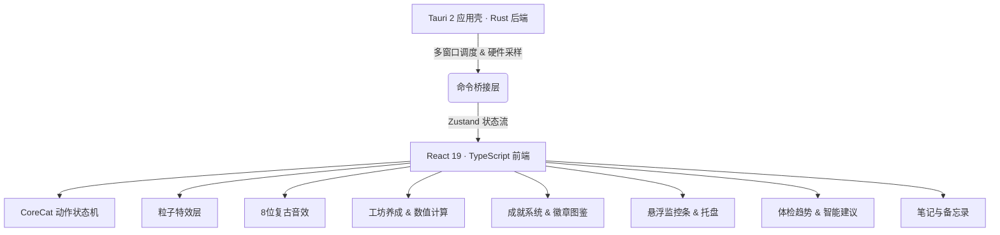

# CoreWorkPal ⚙️🐱

> **把你的 CPU/GPU/RAM 占用率，变成一只猫的冒险故事。**

**CoreWorkPal** 是一款面向开发者与重度 PC 用户的轻量级桌面伴侣，基于 **Tauri 2 + React 19 + TypeScript + Rust** 构建。它实时监控你电脑的硬件状态（CPU、GPU、内存、温度、网络、磁盘），并将这些枯燥的数字转化为一只叫 **CoreCat** 的像素猫咪的动态行为、工坊养成进度、健康趋势洞察、可收藏的笔记备忘，以及可收集的成就徽章——让每一天的工作都变得更有趣、更有序。

---

## 🌟 它能做什么？

### 🐈 CoreCat 桌面宠物 · 硬件驱动的活体表演

CoreCat 是一只透明悬浮在桌面上的像素猫咪，她的行为完全由你的**实时硬件状态**驱动：

| 你的电脑状态 | CoreCat 的反应 |
|:---|:---|
| CPU 高负载 | 疯狂整理文件、汗流浃背地修电脑 |
| 内存快满了 | 抱头蹲在角落、发出警告声 |
| 温度过高 | 拿扇子拼命扇风、喘粗气 |
| 系统闲置 | 懒洋洋打盹、偶尔伸懒腰 |
| 刚刚升级 | 蹦跳庆祝、满屏星光粒子特效 |
| 检测到编译任务 | 陪你一起敲键盘，给出专属反应 |

- **多层动画系统**：骨骼节点驱动的帧动画、CSS 变换、独立的粒子特效层（气泡、火花、蒸汽、星光）
- **进程感知**：识别编译器 / 浏览器 / IDE / 游戏等进程类型，CoreCat 会在气泡里讲出对应的小故事
- **8 位复古音效**：升级、互动、报警触发时配有机械感的像素音效反馈
- **可互动**：点击"抚摸猫咪"或"整理零件"，CoreCat 会有专属响应动作

---

### 🛠️ 硬件养成工坊 · 让负载变成资源

工坊系统将你每天使用电脑产生的硬件负载转化为可用资源：

- **CPU / GPU / 内存** 占用 → 产生 🔧 **零件**
- **网络吞吐 / 磁盘读写** 活跃度 → 产生 💡 **灵感**

用这些资源可以升级：
- **工坊主等级**（全局产出加成，上限 100 级）
- **6 大硬件工作台子模块**：CPU 核心工作台、GPU 渲染流水线、RAM 零件仓库、NET 数据传输站、TEMP 冷却风扇墙、DISK 数据归档柜

每个模块升级都有独立的效能加成曲线与非线性资源消耗设计，适合长期策略养成。

---

### 📊 系统监控 · 实时、专业、无打扰

- **悬浮监控条**：微型 / 默认 / 展开三档布局，可自由拖动并记忆位置，支持任意组合显示 CPU、内存、磁盘、网络、GPU 等指标
- **任务栏状态集成**：可嵌入系统任务栏辅助区，常驻显示核心数据；右键任务栏区域可唤起与托盘图标一致的原生快捷菜单
- **主控制台仪表盘**：六大硬件模块实时状态卡片 + 历史负载走势图表 + 诊断日志
- **内存释放**：匹配开源方案中优秀的内存回收机制，支持手动一键释放（托盘菜单 / 设置面板 / 任务栏右键）与按阈值自动释放
  - 手动释放触发 UAC 提权后执行全量清理（清空 Standby / Modified 列表、系统文件缓存工作集、所有进程工作集），拒绝提权则自动降级为轻量清理
  - 自动释放监测系统内存占用，超过设定阈值（默认 8 GB，可调）时静默执行轻量清理，60 秒冷却防抖，不打扰用户
  - 释放完成后 CoreCat 播放专属动画并在气泡中反馈释放结果
- **高精度温度源**：可选启用 [LibreHardwareMonitor](https://github.com/LibreHardwareMonitor/LibreHardwareMonitor) 接入，获取比系统热区更精确的 CPU 核心温度；未启用时回退到系统热区估算，CPU 面板会标注当前来源（高精度 / 估算）

---

### 📋 工况日报 · 自动生成每日记录

- 每日自动汇总当天的硬件负载曲线、资源产出、异常事件
- 可生成带评级（C / B / A / S / SS）的工况卡片，评级由工作分、连续打卡、负载强度、稳定度综合决定
- 工况卡片稀有度会触发对应的成就解锁
- 支持「复制报告卡」与「导出图片卡」（PNG）两种分享方式

---

### 🩺 体检页面（health_check_page） · 你的工作健康画像

把分散在日报里的数据拉长到周/月尺度，回答"我最近的工作状态怎么样"。所有聚合都走轻量的单日打分路径（O(1)），即使 90 天也能毫秒级生成。

- **三档时间窗口**：7 天 / 30 天 / 90 天自由切换，适配短期复盘与长期趋势
- **每日工作分趋势**：柱状图直观呈现每天的得分走势，一眼看出高产日与低谷日
- **综合健康分**：独立的 0–100 评分算法，融合「持续活跃度 / 系统稳定度 / 坚持一致性」三个维度，给出 S / A / B / C 评级——它不奖励蛮干，而是奖励可持续的节奏
- **五维均值**：运行时长、负载强度、任务复杂、系统稳定、连续投入的周期平均，定位短板
- **工作日画像**：周一到周日的平均分对比，告诉你哪天最高产
- **连续打卡 & 环比**：当前连续天数 / 最长连续 / 活跃天数，以及本周期相对上一周期的变化（带正向 / 负向着色）
- **周期亮点**：最高分日、最长工作日、最热日一目了然

> 体检页是纯本地的自我观察工具，数据全部来自已有的工况日志，不引入任何额外采集。

---

### 📝 笔记页面（note_page） · 笔记与备忘录一体化

一个轻量的本地记录模块，把"想记下来的事"和"要做的事"放进同一个地方。极简风格，零云端、零账号，打开即用。

- **统一实体，类型区分**：一条记录要么是**笔记**（长文，支持 Markdown），要么是**备忘录**（短文 + 可选时间标记）；同一列表，按类型筛选切换
- **弹窗式读写**：查看、编辑、新建都在独立弹窗中完成，列表页只负责展示预览——阅读和书写互不干扰
- **基础 Markdown 渲染**：笔记正文支持 `# 标题`、`- 列表`、`**粗体****、`` `代码` ``、`[链接](url)`；编辑时是纯文本，保存后自动渲染。渲染器零依赖、内置 HTML 转义，安全可控
- **置顶 / 归档 / 删除**：重要记录置顶常驻；完成的记录归档隐藏（不丢失）；不需要的硬删除（带二次确认）
- **四色标签**：每条记录可标记 default / orange / cyan / gold 四种颜色，左侧色条快速区分
- **Markdown 导入 / 导出**：一键将笔记导出为 `.md` 文件，或从本地 `.md` 文件导入为新笔记（自动解析标题）
- **全屏沉浸阅读**：查看笔记时可切换全屏阅读模式，隐藏工具栏，加大字号与行距，专注阅读
- **明暗阅读模式**：全屏阅读支持白天（暖纸感浅底深字）和夜间（深灰底柔和浅字）两种护眼配色，长时间阅读不伤眼
- **快捷键**：编辑弹窗内 `Ctrl+S` 保存、`Esc` 取消、标题框 `Enter` 保存；查看弹窗 `Esc` 关闭
- **纯本地持久化**：所有笔记以 `notes.json` 存于本机，原子写入 + 损坏自动备份，重启不丢失

> 备忘录的「提醒时间」目前只做展示标记，不主动弹窗提醒——保持极简，不打扰。

---

### 🏆 成就系统 · 133 个可收集徽章

CoreWorkPal 内置完整的成就体系，记录你与 CoreCat 共同走过的每一个里程碑：

- **133 个成就**，覆盖 7 大类别：使用习惯、系统监控、工坊升级、工况日志、隐藏彩蛋等
- **6 个难度等级**：入门 → 进阶 → 熟练 → 精英 → 史诗 → 传说，难度越高徽章越稀有
- **像素徽章图鉴**：每个成就对应一枚独立设计的复古像素风格徽章（.webp 格式），含稀有度框架与主题色系
- **隐藏成就**：部分成就条件刻意不提示，需要自行探索触发
- **进度追踪**：每个成就显示当前达成进度条与具体数值，解锁后奖励成就积分
- **快照导入 / 导出**：支持复制成就图鉴快照到剪贴板，或从剪贴板导入外部快照，解锁协作分享类成就

> 成就积分可在工坊中体现，鼓励持续深度使用。

---

## 📸 界面截图

### 🖥️ 主控制台 — 硬件状态一目了然


---

### 🧩 设备清单 — 硬件配置尽收眼底


---

### 🛠️ 工坊系统

| 工坊主页面 | 子模块升级详情 |
| :---: | :---: |
|  |  |

---

### 🩺 体检报告 & 📝 笔记备忘

| 体检页面 | 笔记页面 |
| :---: | :---: |
|  |  |

---

### 🏆 成就图鉴


---

### ⚙️ 工况日报 & 系统设置

| 工况日报 | 系统设置 |
| :---: | :---: |
|  |  |

---

## 🛠️ 技术架构



### 后端 · Rust / Tauri 2

- **毫秒级硬件采样**：低开销多线程循环采集 CPU、GPU、内存、温度、磁盘、网络数据
- **多窗口协同管理**：主控制台、桌面宠物（透明鼠标穿透）、监控挂件、托盘菜单
- **本地优先存储**：所有持久化数据（设置、工坊、日报、专注、成就、笔记）以 JSON 文件存于本机，原子写入 + 损坏自动备份
- **生产环境无黑框**：`windows_subsystem` 配置自动隐藏后台命令行窗口

### 前端 · React / TypeScript / Zustand

- **分模块状态管理**：`settingsStore`、`workshopStore`、`hardwareStore`、`petStore`、`workLogStore`、`achievementStore`、`healthStore`、`suggestionsStore`、`notesStore`、`focusStore`、`uiStore` 等 11 个 Store，多窗口数据单向同步
- **像素渲染**：所有图标在 SVG 内定义，配合 `image-rendering: pixelated` 保持清晰锐利的像素质感
- **成就引擎**：基于事件驱动的触发器系统，支持复合条件判断与进度持久化
- **零额外运行时依赖**：前端仅依赖 React / Zustand / Tauri API，连 Markdown 渲染都是内置零依赖实现

---

## 📂 项目结构

```text
├── .docs/                    # 开发进度追踪与路线图
├── scripts/                  # 辅助工具脚本
│   ├── generate_badges.py            # 成就徽章像素图批量生成脚本
│   ├── optimize-animation-pngs.mjs   # 帧动画无损压缩脚本
│   └── run-corecat-animation-tests.mjs  # 状态机回归测试脚本
├── src-tauri/                # Tauri 2 后端 (Rust)
│   ├── src/
│   │   ├── monitoring/       # 硬件监测（CPU/GPU/内存/网络/磁盘/温度 + LibreHardwareMonitor）
│   │   ├── commands/         # Tauri 命令层（工坊、成就、日志、笔记、体检等）
│   │   ├── suggestions/      # 本地智能建议引擎
│   │   ├── memory_release/   # 内存释放（UAC 提权 + 自动降级）
│   │   ├── tray/             # 托盘图标与右键菜单
│   │   ├── achievements/     # 成就定义、触发与持久化
│   │   ├── lib.rs            # 窗口配置与核心初始化
│   │   └── main.rs           # 程序入口
│   └── tauri.conf.json
└── src/                      # 前端 (React 19 + TypeScript)
    ├── assets/
    │   ├── achievements/     # 133 枚像素风格成就徽章 (.webp)
    │   ├── pets/             # CoreCat 动画帧与头像
    │   └── screenshots/      # README 展示截图
    ├── pages/                # 多页面组件（控制台/工坊/日报/体检/笔记/成就/设置/关于）
    ├── pet/                  # CoreCat 状态机、骨骼节点、粒子特效
    ├── services/             # 成就触发器、数值计算、Markdown 渲染、Tauri 桥接
    ├── stores/               # 全局状态（11 个 Store）
    └── ui/                   # 基础组件库与像素图标系统
```

---

## 🚀 快速启动

> 需要本地安装 **Node.js ≥ 18**、**Rust/Cargo**、**pnpm**

```bash
# 1. 安装前端依赖
pnpm install

# 2. 启动开发模式（含热更新）
pnpm tauri dev

# 3. 类型检查
pnpm typecheck

# 4. Rust 单元测试
cd src-tauri && cargo test

# 5. 压缩宠物帧动画资源
pnpm optimize:animations

# 6. 生产构建（打包 .exe 安装包）
pnpm tauri build
```

构建产物：
- **免安装绿色版**：`src-tauri/target/release/core-work-pal.exe`
- **NSIS 安装包**：`src-tauri/target/release/bundle/nsis/CoreWorkPal_x64-setup.exe`

> 当前打包目标为 NSIS。若需生成 MSI 安装包，需额外下载 [WiX 工具集](https://wixtoolset.org/)（首次打包时 Tauri 会自动拉取，也可手动放置到 `%LOCALAPPDATA%\tauri\WixTools314\`）。

---

## 📋 更新日志

### v0.3.3

**新功能**
- 📝 笔记支持从本地 `.md` 文件导入（自动解析 H1 标题为笔记标题）
- 📖 笔记查看新增全屏沉浸阅读模式（加大字号、宽行距、隐藏工具栏）
- 🌙 全屏阅读支持白天（暖纸感）和夜间（深灰护眼）两种阅读配色
- 🏆 成就图鉴新增"导入外部快照"功能，解锁协作分享类成就

**修复**
- 🐛 修复 GPU 显存显示错误（≥4GB 显卡被 uint32 截断，改用注册表 qwMemorySize 读取准确值）
- 🐛 修复工坊升级经常失败需多次点击（前端旧快照覆盖监控泵实时数据 + 浮点精度临界误判）
- 🐛 修复 25+ 个成就永远无法解锁（高负载时长 / 磁盘流量 / 网络流量 / CPU·GPU·内存超阈值时长 / 低功耗时长等 lifetime 计数器未采集）
- 🐛 修复专注会话完成时奖励丢失且成就未记录的问题
- 🐛 修复笔记编辑保存失败时静默关闭（现显示错误提示并保持弹窗打开）
- 🐛 修复设置滑块拖动时频繁写盘 + 乐观更新回滚失效
- 🐛 修复多个窗口的渲染崩溃无法恢复（ErrorBoundary 现支持重试 + 重新加载数据）

**优化**
- ⚡ 监控采样泵周期更精准（扣除单 tick 处理耗时）
- ⚡ 专注会话期间强制前台采样间隔，提升分心检测精度
- 🔒 子进程（nvidia-smi / PowerShell）加 8s 超时保护，防止挂起冻结监控
- 🔒 更新检查 / 下载加网络超时（20s / 120s），防止无限等待
- 🔒 数据文件写入失败时完整回滚内存状态，保证内存与磁盘一致
- 🔒 启动时单个数据文件损坏不再崩溃，降级为默认值继续运行

---

## 🛡️ 安全与隐私

- **纯本地运行**：所有数据（硬件指标、工坊进度、日报、笔记、成就）仅存储于本机，不向任何服务器上传用户数据、进程列表或网络信息
- **开源透明**：完整源代码托管于 GitHub，可自由审计与编译
  → `https://github.com/FiveDayZ/CoreWorkPal`
- **零隐蔽占用**：不含任何后台网络回传、挖矿或敏感资源占用行为
- **笔记内容安全**：Markdown 渲染内置 HTML 转义，链接仅放行 http(s)/mailto/锚点，杜绝 XSS

---

*CoreWorkPal v0.3.3 · MIT License · Made with ❤️ and a lot of pixel art*
